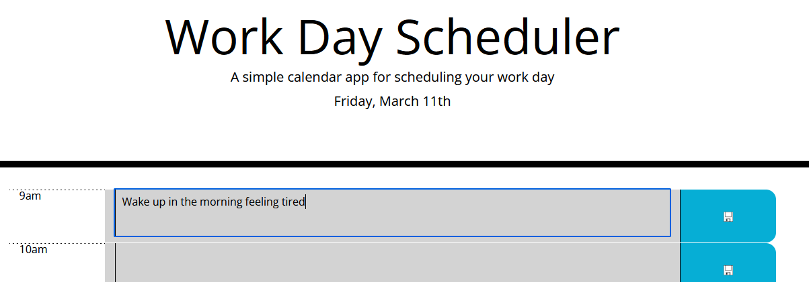
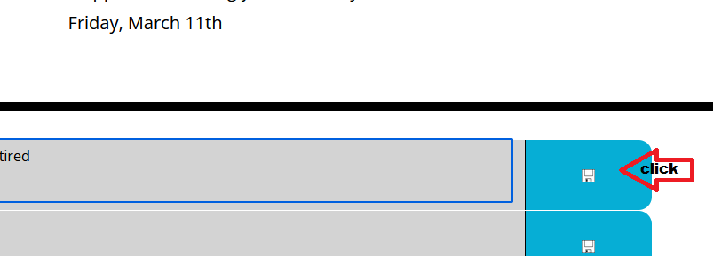
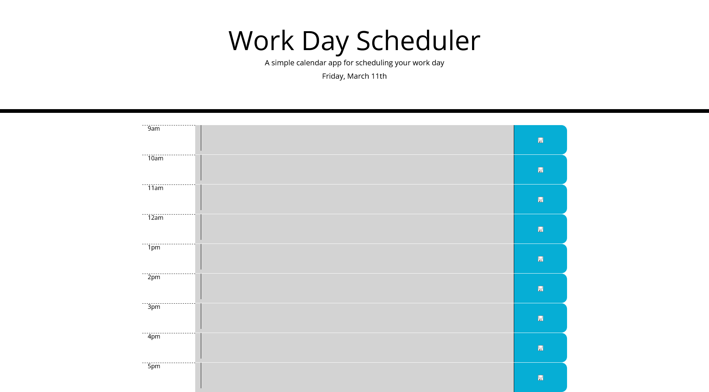

# 05 Work Day Scheduler

## What is it?

This is a simple scheduler that allows the user to record what their tasks for the
day are going to be between 9am and 5pm inclusive (business hours). The user is given 
the ability to save this information locally to their browser so that the information 
will persist on the next visit.

## Purpose

Allows the user to save important information for each hour for the current day, and 
shows upcoming or past saved information.

## How it works

>### Step One:
>
>First, the user enters any text in the field for the given hour
>

>### Step Two:
>
>Then, the user clicks the save button on the far right side of that hour's card.
>
>
>
>The information will then be there the next time the user visits the page.

## Finished Product

Link to live [Scheduler](https://vidalatan.github.io/scheduler)

Link to [Code Repository](https://github.com/Vidalatan/scheduler)